[](https://blog.roboflow.com/roboflow-100) 
[](https://github.com/roboflow-ai/notebooks/blob/main/notebooks/how-to-use-rf100.ipynb) 
[](https://youtu.be/jIgZMr-PBMo)

# Roboflow 100 📸: A Rich, Multi-Domain Object Detection Benchmark


This repository implements the Roboflow 100 benchmark developed by [Roboflow](https://roboflow.com/). It contains code to download the dataset and reproduce
mAP values for YOLOv5 and YOLOv7 Fine-Tuning and GLIP Evaluation on 100 of Roboflow Universe
datasets.


*RF100 was sponsored with ❤️ by [Intel](https://www.intel.com/content/www/us/en/homepage.html)*

RF100 paper is on [arxiv](https://arxiv.org/abs/2211.13523), if you used RF100 in your research, **please consider citing us**

```
@misc{2211.13523,
Author = {Floriana Ciaglia and Francesco Saverio Zuppichini and Paul Guerrie and Mark McQuade and Jacob Solawetz},
Title = {Roboflow 100: A Rich, Multi-Domain Object Detection Benchmark},
Year = {2022},
Eprint = {arXiv:2211.13523},
}
```

## RF100

`RF100` contains the following datasets, carefully chosen from more than 90'000 datasets hosted on our [universe hub](https://universe.roboflow.com/). The datasets are splitted in 7 categories: `Aerial`, `Videogames`, `Microscopic`, `Underwater`, `Documents`, `Electromagnetic` and `Real World`. 


| Category        | Datasets | Images  | Classes |
|-----------------|----------|---------|---------|
| Aerial          | 7        | 9683    | 24      |
| Videogames      | 7        | 11579   | 88      |
| Microscopic     | 11       | 13378   | 28      |
| Underwater      | 5        | 18003   | 39      |
| Documents       | 8        | 24813   | 90      |
| Electromagnetic | 12       | 36381   | 41      |
| Real World      | 50       | 110615  | 495     |
| **Total**           | **100**      | **224,714** | **805**     |


**Note** some datasets failed, only on `88`

| category        |   yolov5 |   yolov7 |   yolov8 |      glip |
|:----------------|---------:|---------:|---------:|----------:|
| aerial          | 0.636    | 0.504286 | 0.707286 | 0.0238571 |
| documents       | 0.716125 | 0.7225   | 0.79775  | 0.018625  |
| electromagnetic | 0.7423   | 0.639    | 0.7899   | 0.0697    |
| microscopic     | 0.650727 | 0.59166  | 0.747455 | 0.0230909 |
| real world      | 0.781659 | 0.705276 | 0.842171 | 0.117049  |
| underwater      | 0.56     | 0.6624   | 0.7024   | 0.1876    |
| videogames      | 0.863333 | 0.783167 | 0.881    | 0.1625    |
| **Total**       | **0.7071**   | **0.6583**   | **0.7811**   | **0.0860**    |

🚨 **Head over the [Appendix](#appendix) at the bottom to see samples from each dataset**

We provide a [notebook to help you using RF100 with PyTorch](/notebooks/roboflow-100-pytorch.ipynb)

## Getting Started

First, clone this repo and go inside it.

```bash
git clone https://github.com/roboflow-ai/roboflow-100-benchmark.git
cd roboflow-100-benchmark
git submodule update --init --recursive
```

You will need an API key. `RF100` can be accessed with any key from Roboflow, head over [our doc](https://docs.roboflow.com/rest-api) to learn how to get one.

Then, export the key to your current shell

```bash
export ROBOFLOW_API_KEY=<YOUR_API_KEY>
```

**Note**: The datasets are taken from `datasets_links.txt`, you can modify that file to add/remove datasets.

### Docker

The easiest and faster way to download `RF100` is using [docker](https://docs.docker.com/engine/install/) and our [Dockerfile](Dockerfile.rf100.download).

**NOTE** Be sure to do the [post process steps](https://docs.docker.com/engine/install/linux-postinstall/) after you installed docker, we will read and write to shared volumes so your user should also be in the docker group.

If you have an NVIDIA GPU, be sure to also install [nvidia docker](https://docs.nvidia.com/datacenter/cloud-native/container-toolkit/install-guide.html)

Be sure to have the `ROBOFLOW_API_KEY` in your env, then run it (we are passing our user so you shouldn't have permission errors on `rf100` folder)

```bash
docker run --rm -it \
    -e ROBOFLOW_API_KEY=$ROBOFLOW_API_KEY \
    -v $(pwd)/rf100:/workspace/rf100 \
    -v /etc/group:/etc/group:ro \
    -u "$(id -u):$(id -g)" \
    roboflow/rf100-download
```

`roboflow/rf100-download` is hosted on our [docker hub](https://hub.docker.com/repository/docker/roboflow/rf100-download) 

Internally, `RF100` will downloaded to `/app/rf100`. You can also specify the format with the `-f` flag, by default `coco` is used.

```bash
docker run --rm -it \
    -e ROBOFLOW_API_KEY=$ROBOFLOW_API_KEY \
    -v ${PWD}/rf100:/workspace/rf100 \
    -v /etc/group:/etc/group:ro \
    -u "$(id -u):$(id -g)" \
    roboflow/rf100-download
```

If you want to build the container and not use the image on the hub, run

```bash
docker build -t rf100-download -f Dockerfile.rf100.download .
```


### Local Env

To download `RF100` in your local enviroment (python `>=3.6`), you need to install roboflow

```bash
pip install roboflow
```

Then,

```bash
chmod 770 ./scripts/download_datasets.sh
./scripts/download_datasets.sh
./scripts/download_datasets.sh -f yolov5 $ change format
./scripts/download_datasets.sh -l <path_to_my_location> change download location
```

### Formats

Supported formats are

- `coco`
- `yolov5` (used by YOLOv7 as well)

## Reproduce Results

We will use docker to ensure the same enviroment is used.

First, build the container

```
docker build -t rf100-benchmark -f Dockerfile.rf100.benchmark .
```

Then, follow the guide for each model.

All results are stored inside `./runs`.

> **Warning**
> The run must be uninterrupted otherwise the downloaded datasets may be unfinished or corrupted

> **Warning**
> If you have `permission denied` errors, you can either remove `runs` with `sudo rm -rf ./runs` or give permissions to everybody `sudo chmod -R +x ./runs`.

> **Warning**
> Due to poor code support, random errors and time, we weren't able to run all the models on all datasets. Only 88 datasets were successfully benchmarked on **all** four models

### [YOLOv5](https://github.com/ultralytics/yolov5) Fine-Tuning

**Note**, we will map the current folder to the container file system to persist data

```bash
mkdir -p runs &&
nvidia-docker run --gpus all --rm -it --ipc host --network host --shm-size 64g \
    -e ROBOFLOW_API_KEY=$ROBOFLOW_API_KEY \
    -v ${PWD}/runs:/workspace/runs \
    -v ${PWD}/datasets_links_640.txt:/workspace/datasets_links_640.txt \
    rf100-benchmark ./yolov5-benchmark/train.sh
```

### [YOLOv7](https://github.com/WongKinYiu/yolov7) Fine-Tuning

**Note**, we will map the current folder to the container file system to persist data

```bash
mkdir -p runs &&
nvidia-docker run --gpus all --rm -d --ipc host --network host --shm-size 64g \
    -e ROBOFLOW_API_KEY=$ROBOFLOW_API_KEY \
    -v ${PWD}/runs:/workspace/runs \
    -v ${PWD}/datasets_links_640.txt:/workspace/datasets_links_640.txt \
    rf100-benchmark ./yolov7-benchmark/train.sh
```

### [YOLOv8](https://github.com/WongKinYiu/yolov7) Fine-Tuning

**Note**, Doc coming soon but we have the results (was done internally by another team member)

**Note** The model failed on these datasets: `bone-fracture-7fylg`, `brain-tumor-m2pbp`, `cable-damage`, `circuit-elements` and `printed-circuit-board`


### [GLIP](https://github.com/microsoft/GLIP)

**Note** The model failed on these datasets: `apex-videogame`, `apples-fvpl5`, `hand-gestures-jps7z`, `road-traffic`,
       `wall-damage`

```bash
mkdir -p runs &&
nvidia-docker run --gpus all --rm -it --ipc host --network host --shm-size 64g \
    -e ROBOFLOW_API_KEY=$ROBOFLOW_API_KEY \
    -v ${PWD}/runs:/workspace/runs \
    -v ${PWD}/datasets_links_640.txt:/workspace/datasets_links_640.txt \
    rf100-benchmark ./GLIP-benchmark/train.sh
```


## Appendix

## YOLOs Comparison

**Note** 5 datasets failed on `v8`, so the comparison is only on `95`. Check [`v8`](#yolov8-fine-tuning) for more info.

**Note** We only train one seed for each model, take these results with a **grain of salt**

The following box plots shows `mAP@.50` for each YOLOs model on RF100


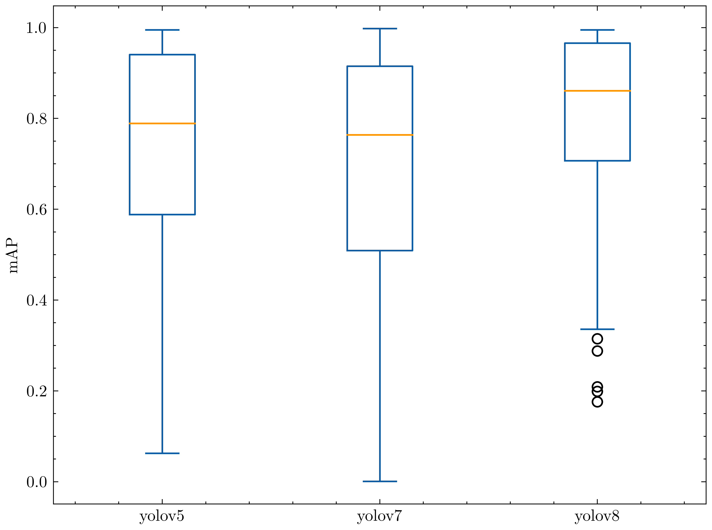

The following bar plots shows `mAP@.50` for each YOLOs model on each RF100 category

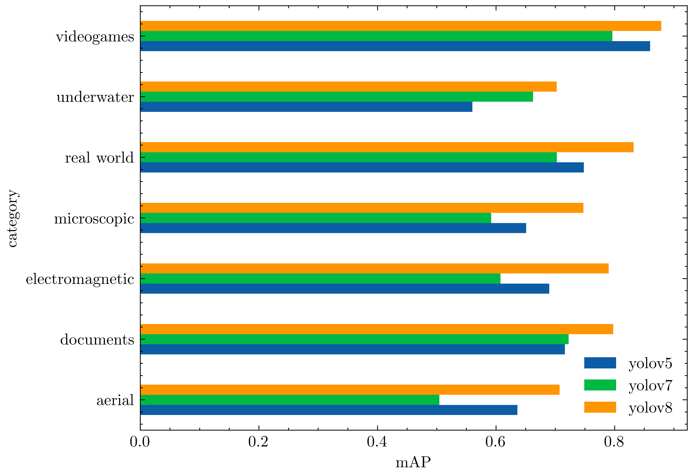


### Samples

| dataset                                                                                                   | category        | samples                                                   |
|:----------------------------------------------------------------------------------------------------------|:----------------|:----------------------------------------------------------|
| [hand-gestures-jps7z](https://universe.roboflow.com/roboflow-100/hand-gestures-jps7z)                     | real world      |            |
| [smoke-uvylj](https://universe.roboflow.com/roboflow-100/smoke-uvylj)                                     | real world      | 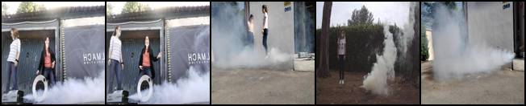                   |
| [wall-damage](https://universe.roboflow.com/roboflow-100/wall-damage)                                     | real world      | 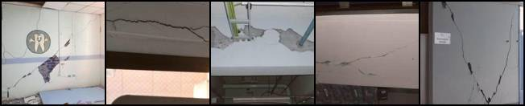                   |
| [corrosion-bi3q3](https://universe.roboflow.com/roboflow-100/corrosion-bi3q3)                             | real world      | 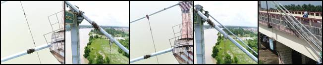               |
| [excavators-czvg9](https://universe.roboflow.com/roboflow-100/excavators-czvg9)                           | real world      | 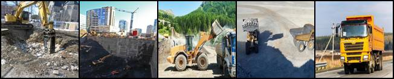              |
| [chess-pieces-mjzgj](https://universe.roboflow.com/roboflow-100/chess-pieces-mjzgj)                       | real world      | 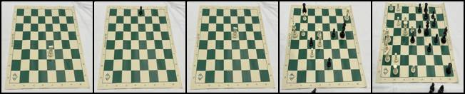            |
| [road-signs-6ih4y](https://universe.roboflow.com/roboflow-100/road-signs-6ih4y)                           | real world      | 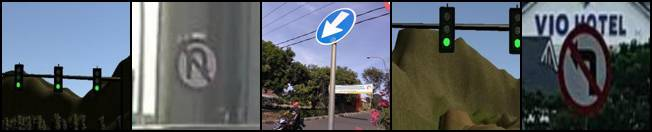              |
| [street-work](https://universe.roboflow.com/roboflow-100/street-work)                                     | real world      | 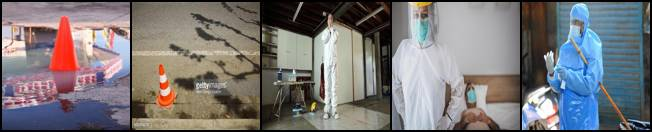                   |
| [construction-safety-gsnvb](https://universe.roboflow.com/roboflow-100/construction-safety-gsnvb)         | real world      |      |
| [road-traffic](https://universe.roboflow.com/roboflow-100/road-traffic)                                   | real world      | 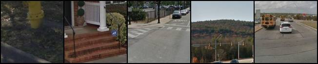                  |
| [washroom-rf1fa](https://universe.roboflow.com/roboflow-100/washroom-rf1fa)                               | real world      | 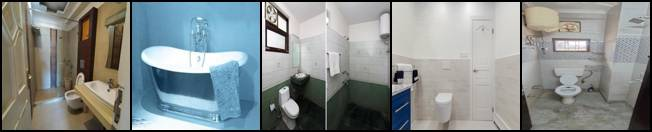                |
| [circuit-elements](https://universe.roboflow.com/roboflow-100/circuit-elements)                           | real world      | 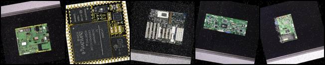              |
| [mask-wearing-608pr](https://universe.roboflow.com/roboflow-100/mask-wearing-608pr)                       | real world      |             |
| [cables-nl42k](https://universe.roboflow.com/roboflow-100/cables-nl42k)                                   | real world      | 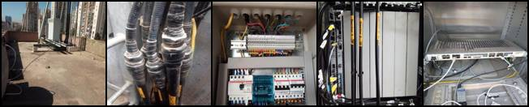                  |
| [soda-bottles](https://universe.roboflow.com/roboflow-100/soda-bottles)                                   | real world      | 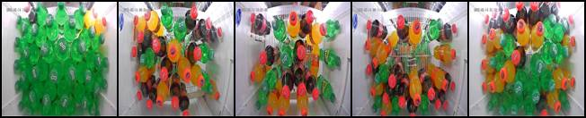                  |
| [truck-movement](https://universe.roboflow.com/roboflow-100/truck-movement)                               | real world      | 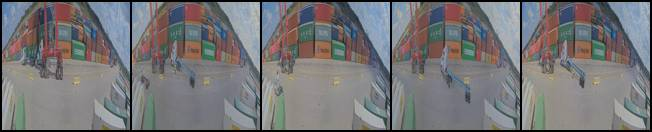                |
| [wine-labels](https://universe.roboflow.com/roboflow-100/wine-labels)                                     | real world      |                    |
| [digits-t2eg6](https://universe.roboflow.com/roboflow-100/digits-t2eg6)                                   | real world      | 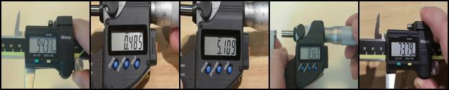                  |
| [vehicles-q0x2v](https://universe.roboflow.com/roboflow-100/vehicles-q0x2v)                               | real world      | 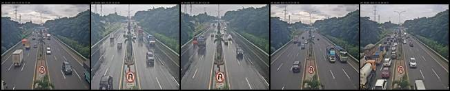                |
| [peanuts-sd4kf](https://universe.roboflow.com/roboflow-100/peanuts-sd4kf)                                 | real world      | 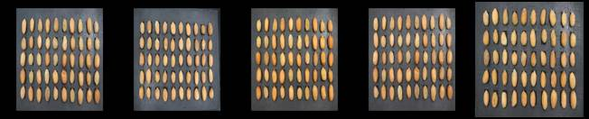                 |
| [printed-circuit-board](https://universe.roboflow.com/roboflow-100/printed-circuit-board)                 | real world      | 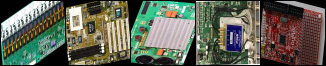         |
| [pests-2xlvx](https://universe.roboflow.com/roboflow-100/pests-2xlvx)                                     | real world      | 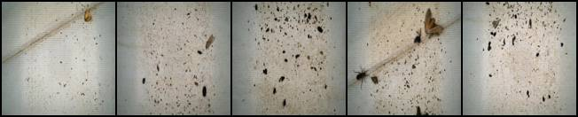                   |
| [cavity-rs0uf](https://universe.roboflow.com/roboflow-100/cavity-rs0uf)                                   | real world      | 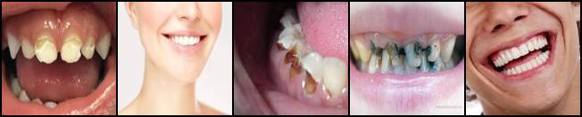                  |
| [leaf-disease-nsdsr](https://universe.roboflow.com/roboflow-100/leaf-disease-nsdsr)                       | real world      | 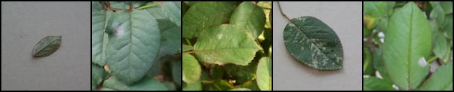            |
| [marbles](https://universe.roboflow.com/roboflow-100/marbles)                                             | real world      | 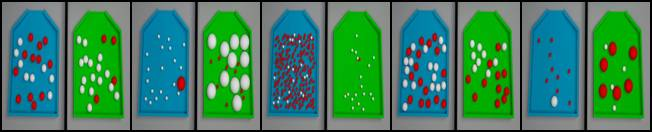                       |
| [pills-sxdht](https://universe.roboflow.com/roboflow-100/pills-sxdht)                                     | real world      | 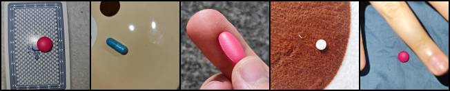                   |
| [poker-cards-cxcvz](https://universe.roboflow.com/roboflow-100/poker-cards-cxcvz)                         | real world      | 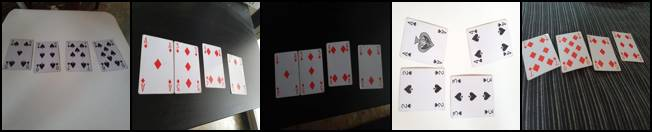             |
| [number-ops](https://universe.roboflow.com/roboflow-100/number-ops)                                       | real world      | 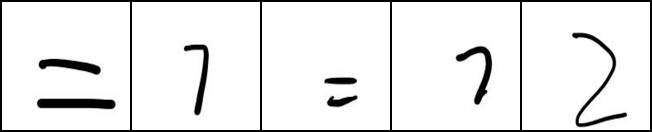                    |
| [insects-mytwu](https://universe.roboflow.com/roboflow-100/insects-mytwu)                                 | real world      | 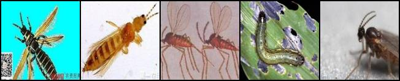                 |
| [cotton-20xz5](https://universe.roboflow.com/roboflow-100/cotton-20xz5)                                   | real world      | 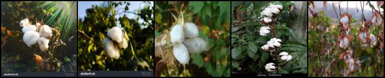                  |
| [furniture-ngpea](https://universe.roboflow.com/roboflow-100/furniture-ngpea)                             | real world      | 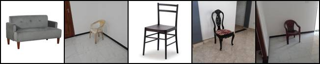               |
| [cable-damage](https://universe.roboflow.com/roboflow-100/cable-damage)                                   | real world      | 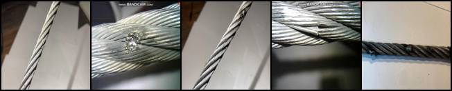                  |
| [animals-ij5d2](https://universe.roboflow.com/roboflow-100/animals-ij5d2)                                 | real world      | 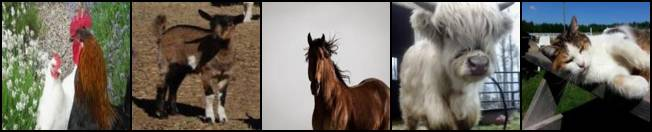                 |
| [coins-1apki](https://universe.roboflow.com/roboflow-100/coins-1apki)                                     | real world      | 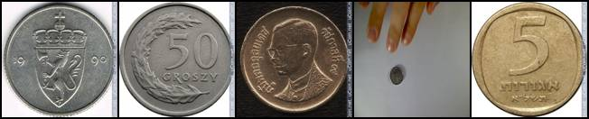                   |
| [apples-fvpl5](https://universe.roboflow.com/roboflow-100/apples-fvpl5)                                   | real world      | 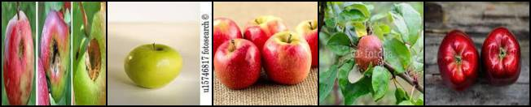                  |
| [people-in-paintings](https://universe.roboflow.com/roboflow-100/people-in-paintings)                     | real world      |            |
| [circuit-voltages](https://universe.roboflow.com/roboflow-100/circuit-voltages)                           | real world      | 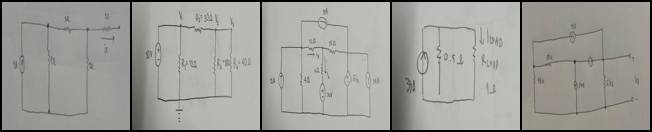              |
| [uno-deck](https://universe.roboflow.com/roboflow-100/uno-deck)                                           | real world      | 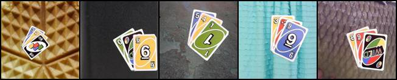                      |
| [grass-weeds](https://universe.roboflow.com/roboflow-100/grass-weeds)                                     | real world      | 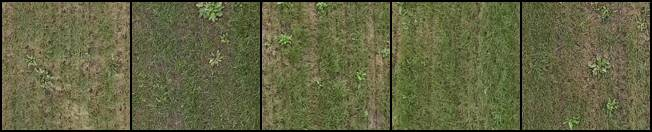                   |
| [gauge-u2lwv](https://universe.roboflow.com/roboflow-100/gauge-u2lwv)                                     | real world      |                    |
| [sign-language-sokdr](https://universe.roboflow.com/roboflow-100/sign-language-sokdr)                     | real world      | 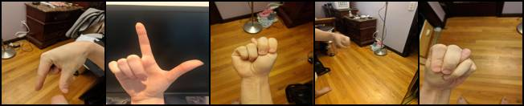           |
| [valentines-chocolate](https://universe.roboflow.com/roboflow-100/valentines-chocolate)                   | real world      | 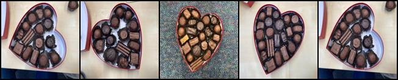          |
| [fish-market-ggjso](https://universe.roboflow.com/roboflow-100/fish-market-ggjso)                         | real world      | 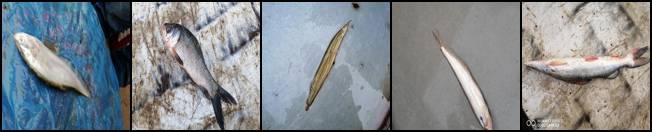             |
| [lettuce-pallets](https://universe.roboflow.com/roboflow-100/lettuce-pallets)                             | real world      | 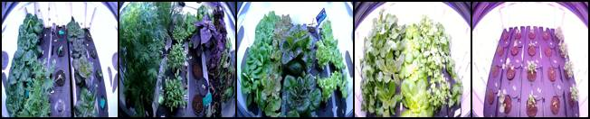               |
| [shark-teeth-5atku](https://universe.roboflow.com/roboflow-100/shark-teeth-5atku)                         | real world      | 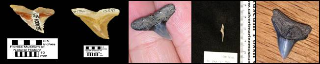             |
| [bees-jt5in](https://universe.roboflow.com/roboflow-100/bees-jt5in)                                       | real world      | 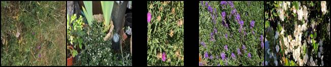                    |
| [sedimentary-features-9eosf](https://universe.roboflow.com/roboflow-100/sedimentary-features-9eosf)       | real world      | 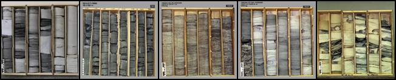    |
| [currency-v4f8j](https://universe.roboflow.com/roboflow-100/currency-v4f8j)                               | real world      | 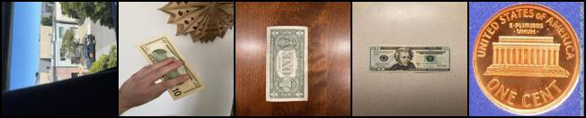                |
| [trail-camera](https://universe.roboflow.com/roboflow-100/trail-camera)                                   | real world      | 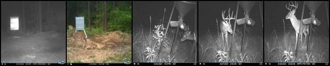                  |
| [cell-towers](https://universe.roboflow.com/roboflow-100/cell-towers)                                     | real world      | 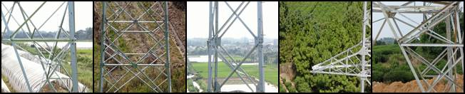                   |
| [apex-videogame](https://universe.roboflow.com/roboflow-100/apex-videogame)                               | videogames      | 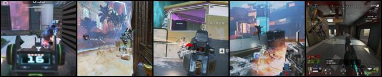                |
| [farcry6-videogame](https://universe.roboflow.com/roboflow-100/farcry6-videogame)                         | videogames      | 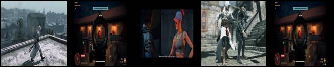             |
| [csgo-videogame](https://universe.roboflow.com/roboflow-100/csgo-videogame)                               | videogames      | 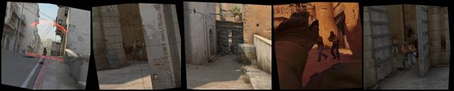                |
| [avatar-recognition-nuexe](https://universe.roboflow.com/roboflow-100/avatar-recognition-nuexe)           | videogames      |       |
| [halo-infinite-angel-videogame](https://universe.roboflow.com/roboflow-100/halo-infinite-angel-videogame) | videogames      | 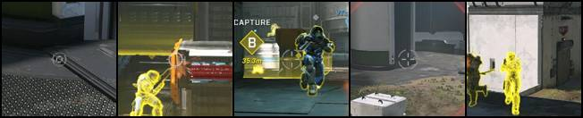 |
| [team-fight-tactics](https://universe.roboflow.com/roboflow-100/team-fight-tactics)                       | videogames      |             |
| [robomasters-285km](https://universe.roboflow.com/roboflow-100/robomasters-285km)                         | videogames      |              |
| [tweeter-posts](https://universe.roboflow.com/roboflow-100/tweeter-posts)                                 | documents       |                  |
| [tweeter-profile](https://universe.roboflow.com/roboflow-100/tweeter-profile)                             | documents       |                |
| [document-parts](https://universe.roboflow.com/roboflow-100/document-parts)                               | documents       |                 |
| [activity-diagrams-qdobr](https://universe.roboflow.com/roboflow-100/activity-diagrams-qdobr)             | documents       |        |
| [signatures-xc8up](https://universe.roboflow.com/roboflow-100/signatures-xc8up)                           | documents       |               |
| [paper-parts](https://universe.roboflow.com/roboflow-100/paper-parts)                                     | documents       |                    |
| [tabular-data-wf9uh](https://universe.roboflow.com/roboflow-100/tabular-data-wf9uh)                       | documents       |             |
| [paragraphs-co84b](https://universe.roboflow.com/roboflow-100/paragraphs-co84b)                           | documents       |               |
| [underwater-pipes-4ng4t](https://universe.roboflow.com/roboflow-100/underwater-pipes-4ng4t)               | underwater      |         |
| [aquarium-qlnqy](https://universe.roboflow.com/roboflow-100/aquarium-qlnqy)                               | underwater      |                 |
| [peixos-fish](https://universe.roboflow.com/roboflow-100/peixos-fish)                                     | underwater      |                    |
| [underwater-objects-5v7p8](https://universe.roboflow.com/roboflow-100/underwater-objects-5v7p8)           | underwater      |       |
| [coral-lwptl](https://universe.roboflow.com/roboflow-100/coral-lwptl)                                     | underwater      |                    |
| [aerial-pool](https://universe.roboflow.com/roboflow-100/aerial-pool)                                     | aerial          |                    |
| [secondary-chains](https://universe.roboflow.com/roboflow-100/secondary-chains)                           | aerial          |               |
| [aerial-spheres](https://universe.roboflow.com/roboflow-100/aerial-spheres)                               | aerial          |                 |
| [soccer-players-5fuqs](https://universe.roboflow.com/roboflow-100/soccer-players-5fuqs)                   | aerial          |           |
| [weed-crop-aerial](https://universe.roboflow.com/roboflow-100/weed-crop-aerial)                           | aerial          |               |
| [aerial-cows](https://universe.roboflow.com/roboflow-100/aerial-cows)                                     | aerial          |                    |
| [cloud-types](https://universe.roboflow.com/roboflow-100/cloud-types)                                     | aerial          |                    |
| [stomata-cells](https://universe.roboflow.com/roboflow-100/stomata-cells)                                 | microscopic     |                  |
| [bccd-ouzjz](https://universe.roboflow.com/roboflow-100/bccd-ouzjz)                                       | microscopic     |                     |
| [parasites-1s07h](https://universe.roboflow.com/roboflow-100/parasites-1s07h)                             | microscopic     |                |
| [cells-uyemf](https://universe.roboflow.com/roboflow-100/cells-uyemf)                                     | microscopic     |                    |
| [4-fold-defect](https://universe.roboflow.com/roboflow-100/4-fold-defect)                                 | microscopic     |                  |
| [bacteria-ptywi](https://universe.roboflow.com/roboflow-100/bacteria-ptywi)                               | microscopic     |                 |
| [cotton-plant-disease](https://universe.roboflow.com/roboflow-100/cotton-plant-disease)                   | microscopic     |           |
| [mitosis-gjs3g](https://universe.roboflow.com/roboflow-100/mitosis-gjs3g)                                 | microscopic     |                  |
| [phages](https://universe.roboflow.com/roboflow-100/phages)                                               | microscopic     |                         |
| [liver-disease](https://universe.roboflow.com/roboflow-100/liver-disease)                                 | microscopic     |                  |
| [asbestos](https://universe.roboflow.com/roboflow-100/asbestos)                                           | microscopic     |                       |
| [thermal-dogs-and-people-x6ejw](https://universe.roboflow.com/roboflow-100/thermal-dogs-and-people-x6ejw) | electromagnetic |  |
| [solar-panels-taxvb](https://universe.roboflow.com/roboflow-100/solar-panels-taxvb)                       | electromagnetic |             |
| [radio-signal](https://universe.roboflow.com/roboflow-100/radio-signal)                                   | electromagnetic |                   |
| [thermal-cheetah-my4dp](https://universe.roboflow.com/roboflow-100/thermal-cheetah-my4dp)                 | electromagnetic |          |
| [x-ray-rheumatology](https://universe.roboflow.com/roboflow-100/x-ray-rheumatology)                       | electromagnetic |             |
| [acl-x-ray](https://universe.roboflow.com/roboflow-100/acl-x-ray)                                         | electromagnetic |                      |
| [abdomen-mri](https://universe.roboflow.com/roboflow-100/abdomen-mri)                                     | electromagnetic |                    |
| [axial-mri](https://universe.roboflow.com/roboflow-100/axial-mri)                                         | electromagnetic |                      |
| [gynecology-mri](https://universe.roboflow.com/roboflow-100/gynecology-mri)                               | electromagnetic |                 |
| [brain-tumor-m2pbp](https://universe.roboflow.com/roboflow-100/brain-tumor-m2pbp)                         | electromagnetic |              |
| [bone-fracture-7fylg](https://universe.roboflow.com/roboflow-100/bone-fracture-7fylg)                     | electromagnetic |            |
| [flir-camera-objects](https://universe.roboflow.com/roboflow-100/flir-camera-objects)                     | electromagnetic |            |

## Credits

We thank all the authors of the original datasets, below a table linking the Roboflow 100 dataset's name to its original counterpart

| dataset                       | original                                                                                                    |
|:------------------------------|:------------------------------------------------------------------------------------------------------------|
| hand-gestures-jps7z           | https://universe.roboflow.com/hand-gestures-recognition/hand-gestures-dataset                               |
| smoke-uvylj                   | https://universe.roboflow.com/sigma-pub/smoke-detection-sigma                                               |
| wall-damage                   | https://universe.roboflow.com/sina-uyen0/damage_level_detection                                             |
| corrosion-bi3q3               | https://universe.roboflow.com/khaingwintz-gmail-com/dataset--2-pathein-train-plus-v-3-update-mm             |
| excavators-czvg9              | https://universe.roboflow.com/mohamed-sabek-6zmr6/excavators-cwlh0                                          |
| chess-pieces-mjzgj            | https://universe.roboflow.com/joseph-nelson/chess-pieces-new                                                |
| road-signs-6ih4y              | https://universe.roboflow.com/project-sign-detection/traffic-sign-cdfml                                     |
| street-work                   | https://universe.roboflow.com/cone/capacetes-e-cones                                                        |
| construction-safety-gsnvb     | https://universe.roboflow.com/computer-vision/worker-safety                                                 |
| road-traffic                  | https://universe.roboflow.com/due/detection-dlzhy                                                           |
| washroom-rf1fa                | https://universe.roboflow.com/imagetaggingworkspace/washroom-image-tagging                                  |
| circuit-elements              | https://universe.roboflow.com/new-workspace-rzrja/pcb-2.0                                                   |
| mask-wearing-608pr            | https://universe.roboflow.com/joseph-nelson/mask-wearing                                                    |
| cables-nl42k                  | https://universe.roboflow.com/annotationericsson/annotation-2.0                                             |
| soda-bottles                  | https://universe.roboflow.com/food7/test1-iajnv                                                             |
| truck-movement                | https://universe.roboflow.com/psi-dhxqe/psi-rossville-pano                                                  |
| wine-labels                   | https://universe.roboflow.com/wine-label/wine-label-detection                                               |
| digits-t2eg6                  | https://universe.roboflow.com/dmrs/number-1gmaw                                                             |
| vehicles-q0x2v                | https://universe.roboflow.com/7-class/11-11-2021-09.41                                                      |
| peanuts-sd4kf                 | https://universe.roboflow.com/molds-onbk3/peanuts-mckge/                                                    |
| printed-circuit-board         | https://universe.roboflow.com/new-workspace-rzrja/pcb-2.0                                                   |
| pests-2xlvx                   | https://universe.roboflow.com/gugugu/pests-f8kkr                                                            |
| cavity-rs0uf                  | https://universe.roboflow.com/duong-duc-cuong/cavity-n3ioq                                                  |
| leaf-disease-nsdsr            | https://universe.roboflow.com/puri/puri4-ygapu                                                              |
| marbles                       | https://universe.roboflow.com/zhe-fan/marble-images                                                         |
| pills-sxdht                   | https://universe.roboflow.com/mohamed-attia-e2mor/pill-detection-llp4r                                      |
| poker-cards-cxcvz             | https://universe.roboflow.com/roboflow-100/poker-cards-cxcvz                                                |
| number-ops                    | https://universe.roboflow.com/mnist-bvalq/mnist-icrul                                                       |
| insects-mytwu                 | https://universe.roboflow.com/nirmani/yolo-custome-925                                                      |
| cotton-20xz5                  | https://universe.roboflow.com/cotton-nqp2x/bt-cotton                                                        |
| furniture-ngpea               | https://universe.roboflow.com/minoj-selvaraj/furniture-sfocl                                                |
| cable-damage                  | https://universe.roboflow.com/st-hedgehog-yusupov-gmail-com/kanaaat                                         |
| animals-ij5d2                 | https://universe.roboflow.com/dane-sprsiter/barnyard                                                        |
| coins-1apki                   | https://universe.roboflow.com/labelimg/label_coin                                                           |
| apples-fvpl5                  | https://universe.roboflow.com/arfiani-nur-sayidah-9lizr/apple-sorting-2bfhk                                 |
| people-in-paintings           | https://universe.roboflow.com/raya-al/french-paintings-dataset-d2vbe                                        |
| circuit-voltages              | https://universe.roboflow.com/vanitchaporn/circuit-gexit                                                    |
| uno-deck                      | https://universe.roboflow.com/joseph-nelson/uno-cards                                                       |
| grass-weeds                   | https://universe.roboflow.com/jan-douwe/testbl                                                              |
| gauge-u2lwv                   | https://universe.roboflow.com/evankim9903-gmail-com/gauge_detection                                         |
| sign-language-sokdr           | https://universe.roboflow.com/david-lee-d0rhs/american-sign-language-letters                                |
| valentines-chocolate          | https://universe.roboflow.com/chocolates/valentines-chocolates                                              |
| fish-market-ggjso             | https://universe.roboflow.com/commolybroken/dataset-z2vab                                                   |
| lettuce-pallets               | https://universe.roboflow.com/lettucedetector                                                               |
| shark-teeth-5atku             | https://universe.roboflow.com/sharks/shark-taxonomy                                                         |
| bees-jt5in                    | https://universe.roboflow.com/jjb-object-detection-projects/bee-detection-pry0w                             |
| sedimentary-features-9eosf    | https://universe.roboflow.com/sedimentary-structures/sedimentary-features-rmadz                             |
| currency-v4f8j                | https://universe.roboflow.com/alex-hyams-cosqx/cash-counter/                                                |
| trail-camera                  | https://universe.roboflow.com/my-game-pics/my-game-pics                                                     |
| cell-towers                   | https://universe.roboflow.com/yuyang-li/tower_jointv1                                                       |
| apex-videogame                | https://universe.roboflow.com/apex-esoic/apexyolov4                                                         |
| farcry6-videogame             | https://universe.roboflow.com/kais-al-hajjih/farcry6-hackathon                                              |
| csgo-videogame                | https://universe.roboflow.com/new-workspace-rp0z0/csgo-train-yolo-v5                                        |
| avatar-recognition-nuexe      | https://universe.roboflow.com/new-workspace-0pohs/avatar-recognition-rfw8d                                  |
| halo-infinite-angel-videogame | https://universe.roboflow.com/graham-doerksen/halo-infinite-angel-aim                                       |
| team-fight-tactics            | https://universe.roboflow.com/lamaitw/lama-itw/                                                             |
| robomasters-285km             | https://universe.roboflow.com/etp5501-gmail-com/robomasters-colored                                         |
| tweeter-posts                 | https://universe.roboflow.com/tweeter/tweeter                                                               |
| tweeter-profile               | https://universe.roboflow.com/wojciech-blachowski/tweets                                                    |
| document-parts                | https://universe.roboflow.com/new-workspace-vf0ib/calpers                                                   |
| activity-diagrams-qdobr       | https://universe.roboflow.com/public1/activity-diagrams-s7sxv                                               |
| signatures-xc8up              | https://universe.roboflow.com/signature-detection/signaturesdetectiob                                       |
| paper-parts                   | https://universe.roboflow.com/object-detection-alan-devera/object-detection-ycqjb                           |
| tabular-data-wf9uh            | https://universe.roboflow.com/rik-biswas/tabular-data-dh4ek                                                 |
| paragraphs-co84b              | https://universe.roboflow.com/new-workspace-4vus5/singlemcq                                                 |
| underwater-pipes-4ng4t        | https://universe.roboflow.com/underwaterpipes/underwater_pipes_orginal_pictures                             |
| aquarium-qlnqy                | https://universe.roboflow.com/brad-dwyer/aquarium-combined                                                  |
| peixos-fish                   | https://universe.roboflow.com/nasca37/peixos3                                                               |
| underwater-objects-5v7p8      | https://universe.roboflow.com/workspace-txxpz/underwater-detection                                          |
| coral-lwptl                   | https://universe.roboflow.com/nikita-manolis-je2ii/coral-growth-form                                        |
| aerial-pool                   | https://universe.roboflow.com/a-s/uwh                                                                       |
| secondary-chains              | https://universe.roboflow.com/cc_moon/secondaries                                                           |
| aerial-spheres                | https://universe.roboflow.com/mevil-crasta/annotating-spheres---11-04                                       |
| soccer-players-5fuqs          | https://universe.roboflow.com/ilyes-talbi-ptwsp/futbol-players                                              |
| weed-crop-aerial              | https://universe.roboflow.com/new-workspace-csmgu/weedcrop-waifl                                            |
| aerial-cows                   | https://universe.roboflow.com/omarkapur-berkeley-edu/livestalk                                              |
| cloud-types                   | https://universe.roboflow.com/research-project/shallow-cloud                                                |
| stomata-cells                 | https://universe.roboflow.com/new-workspace-fditd/stomata02                                                 |
| bccd-ouzjz                    | https://universe.roboflow.com/team-roboflow/blood-cell-detection-1ekwu                                      |
| parasites-1s07h               | https://universe.roboflow.com/graduao/sistema-para-analise-de-ovos-de-parasitas-em-amostra-de-agua-e-sangue |
| cells-uyemf                   | https://universe.roboflow.com/new-workspace-86q1t/t03-proyecto-celula-dataset-ampliado                      |
| 4-fold-defect                 | https://universe.roboflow.com/kat-laura/defect-detection-gil85                                              |
| bacteria-ptywi                | https://universe.roboflow.com/terada-shoma/gram-positive-bacteria                                           |
| cotton-plant-disease          | https://universe.roboflow.com/quandong-qian/desease-cotton-plant                                            |
| mitosis-gjs3g                 | https://universe.roboflow.com/20029-tkmce-ac-in/mitosis-dwute                                               |
| phages                        | https://universe.roboflow.com/danish2562022-gmail-com/microglia_rgb/                                        |
| liver-disease                 | https://universe.roboflow.com/liver-t5yvf/liver-diseases                                                    |
| asbestos                      | https://universe.roboflow.com/ahmad-rabiee/asbest91                                                         |
| thermal-dogs-and-people-x6ejw | https://universe.roboflow.com/joseph-nelson/thermal-dogs-and-people                                         |
| solar-panels-taxvb            | https://universe.roboflow.com/new-workspace-rt1da/solarpaneldetectmodel                                     |
| radio-signal                  | https://universe.roboflow.com/danil/                                                                        |
| thermal-cheetah-my4dp         | https://universe.roboflow.com/brad-dwyer/thermal-cheetah                                                    |
| x-ray-rheumatology            | https://universe.roboflow.com/publictestsite/xray-rheumatology-images-public                                |
| acl-x-ray                     | https://universe.roboflow.com/objectdetection-9lu9z/detectron2-acl                                          |
| abdomen-mri                   | https://universe.roboflow.com/xinweihe/circle-3train                                                        |
| axial-mri                     | https://universe.roboflow.com/tfg-2nmge/axial-dataset                                                       |
| gynecology-mri                | https://universe.roboflow.com/yuanyuanpei7/5-8w                                                             |
| brain-tumor-m2pbp             | https://universe.roboflow.com/yousef-ghanem-jzj4y/brain-tumor-detection-fpf1f                               |
| bone-fracture-7fylg           | https://universe.roboflow.com/science-research/science-research-2022:-bone-fracture-detection               |
| flir-camera-objects           | https://universe.roboflow.com/thermal-imaging-0hwfw/flir-data-set                                           |

